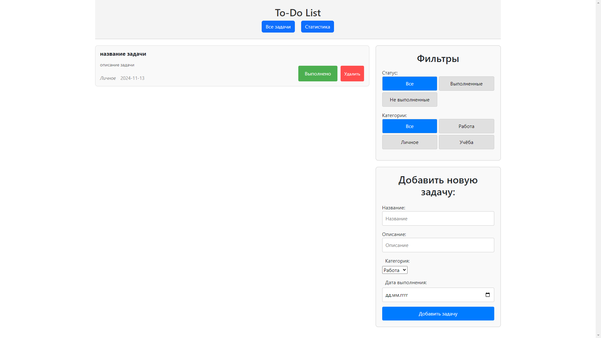

# To-Do List App

Это приложение для управления задачами, созданное с использованием React и Redux. Позволяет добавлять, редактировать, фильтровать и удалять задачи.

## Скриншоты



## Используемые технологии

- **React** — для создания пользовательского интерфейса
- **Redux** — для централизованного управления состоянием приложения
- **CSS (SCSS)** — для стилизации компонентов
- **react-bootstrap** — для ускоренной разработки интерфейса с компонентами Bootstrap
- **json-server** — для реализации фейкового REST API и хранения задач

## Функционал

- Добавление и удаление задач
- Фильтрация задач по категориям
- Сохранение задач и их состояния в локальном хранилище для сохранения данных между сессиями
- Взаимодействие с фейковым сервером с помощью **json-server**, чтобы эмулировать работу с реальным API

## Установка и запуск

1. Клонируйте репозиторий
   ```bash
   git clone https://github.com/AleksandrRDK/AleksandrRDK.github.io.git
   ```
2. Перейдите в папку проекта
   ```bash
   cd to-do_list
   ```
3. Установите зависимости
   ```bash
   npm install
   ```
4. Запустите проект
   ```bash
   npm start
   ```

## Планы по улучшению

- Добавить анимацию
- Добавить авторизацию пользователей

## Автор

Александр Рудаков - [aleksandrrdk.code@gmail.com](mailto:aleksandrrdk.code@gmail.com)
